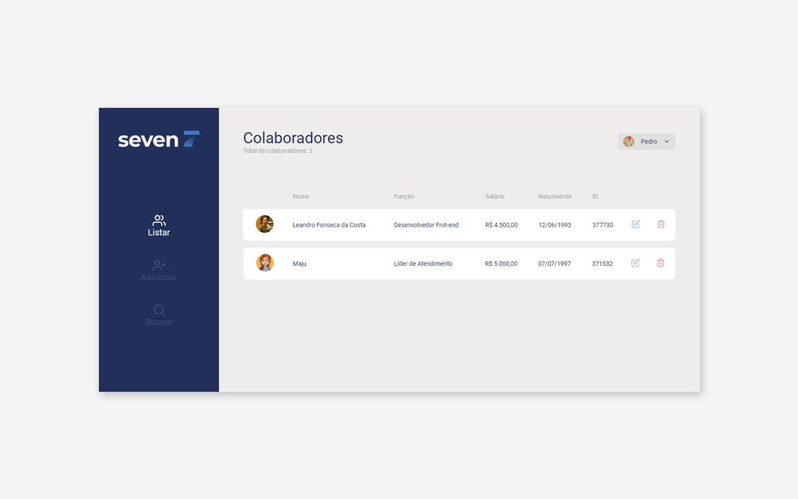

# SevenInc

  

Projeto desenvolvido para o processo seletivo do Grupo Seven para a vaga de Desenvolvedor Front-end.

### Técnologias utilizadas:

* React JS

### Features:

* Listagem de colaboradores
* Cadastro de novos colaboradores
* Edição de um colaborador
* Exclusão de um colaborador
* Busca por colaborador

Por se tratar de  projeto  Front-end não foi desenvolvida uma api, no entanto foi consumida uma API fake utilizando Json Server.

## Testando o código como desenvolvedor

### Você precisará ter instalado em sua máquina:

* <a href="https://nodejs.org/en/">Node</a>
* <a href="https://yarnpkg.com/">Yarn</a>
* Json Server (*comando para instalá-lo:*   **npm install -g json-server**)

### Você deverá:

* Clonar esse repositório em sua máquina.
* Executar o comando **yarn** (*para instalar as dependências do projeto*)
* Executar o comando abaixo para inicializar a API fake: 
**json-server ./src/services/server.json --host *192.168.1.7* --port 3001**
(*troque o IP que está no comando pelo seu antes de executá-lo*)
* Execute o comando **yarn start** para rodar a aplicação no seu coputador.
